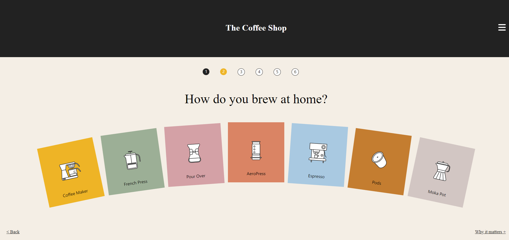

# Cartful Solutions Test

This project was bootstrapped with [Create React App](https://github.com/facebook/create-react-app).

## Available Scripts

## "Problema #1: Maquetación y ReactJS"

In the project directory, you can run:

### `yarn install`
### `yarn start`

Runs the app "Problema #1: Maquetación y ReactJS" in the development mode.\
Open [http://localhost:3000](http://localhost:3000) to view it in your browser.

The page will reload when you make changes.\
You may also see any lint errors in the console.

## "Problema #2: Javascript"
In the project directory "solucion2", you can run the following commands to generate the required .csv file:

### `cd solucion2`
### `Copy the functions from "index.js" file to the details page `

The functions should run in the following page : https://littlesleepies.com/products/rust-rainbows-bamboo-viscose-zippy

## "Problema #3: Lógica Javascript"
In the project directory "solucion3", you can run the following commands to generate the required .csv file:

### `cd solucion3`
### `node index`

Runs the app "Problema #3: Lógica Javascript". It will create a file named "answers.csv" based on the JSON object 
provided in the example

**Note: If you have any doubt, you can reach me at ncanugomez@gmail.com**

